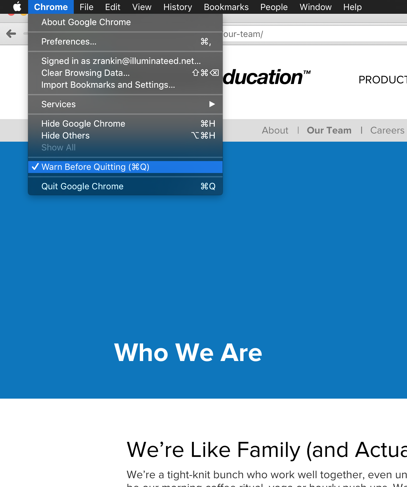

# Tabular *Increase your productivity by 918,675%*

by Zachary Rankin

## This is a weird presentation

Some of you might be wondering why I have prepared this document for you to read before I get up there and do my big presentation.  Well, I recently went to an Edward Tufte [^1] presentation and he brought up some really good points against using PowerPoint for your presentation.  Here are some of the reasons I am trying this out:

- Presentations should be about the content and the audience, not making easy presentations.
- You can skip the information you don't care about.  No need to wait me to go slide by slide.
- The content can be shared, re-read, and improved.  It is really annoying to read through a presentation and only get 5% of what the presenter might have been saying.

This is really just an experiment and I would love to hear your thoughts on the idea so please share your feedback.  My goal is that you will learn at least one thing that will help improve your productivity.

[^1]: Edward Tufte is a data visualization guru. [edwardtufte.com](http://www.edwardtufte.com/tufte/)

## Where my story began

I started working for Achieve Data Solutions (known for DataDirector [^2]) in the summer of 2004.  I started out working as an "office support person".  My job was to do anything people would give me: shopping, cleaning, answering phone calls, scanning, shredding, etc.  Everything seemed pretty sweet until we landed a contract with Sacramento City Unified School District to do all of the printing and scanning for their benchmarks.

[^2]: DataDirector was an assessment and reporting web application.  It was a direct competitor to our Data and Assessment application.

Obviously the task was given to me because I was the most qualified person on the team at the time.  However, I did need a little help, so Mark Walls showed me the process from start to finish.  The process looked sort of like this:

- Design the Scantron sheets using a fancy old sheet designer
- Extract roster information from DataDirector's reporting tools
- Print the sheets by "mail-merging" the roster information with the Scantron design.
- Box and ship the sheets to the right schools.
- Create hundreds of assessments in DataDirector, this included the answer keys, standard alignment, etc.
- Scan thousands of student answer sheets
- Import the results into DataDirector

For those of you who are creating hundreds of assessments--I feel your pain.  During and after this process I felt the need to learn more about the tools I was using so that I could get my job done faster.  I even started to program to make those tools better for myself and everyone else.  I have used a computer just about every day since then and now I want to share with you some of what I have learned.

## Practice and learn your tools

Robert C. Martin in The Clean Coder says "Professionals spend *time* caring for their profession," "Professionals practice," and "Practice is when you specifically exercise your skills *outside* of the performance of your job for the sole purpose of refining and enhancing those skills."

I agree with Robert, and I think that as professionals we need to learn and practice the tools we use.  I don't think anyone would want to go to a doctor who has not practiced doing a surgery, or learned how to use a newer and better tool for the job.

The book "Badass: Making Users Awesome" also talks about practice and mastery.  It says that once a skill has been mastered, it is reliable and automatic.  This means once you master a skill you can focus on your work instead of focusing on the skill.

There are many important skills to be learned and mastered when using your browser, and I would like to share some of them with you.

## Keyboard + mouse

Note: The shortcuts in this document will work for Windows users. Most Mac shortcuts are the same (or very similar) but use the `COMMAND` key in place of the `CTRL` [^3] key.

[^3]: `CTRL` is short for the control key on your keyboard.  Normally to the left of the Alt/Option key.

There is some debate over whether or not using the keyboard is faster than using the mouse.  I think a balance of both will make you the most productive.  For example, learning the keyboard shortcut for Find is going to save you from using the Edit menu and clicking Find every time.  Instead you just type `CTRL + F`

However, if you are browsing or looking for a specific piece of information on a page, maybe a link, then it will be quicker for you to use your mouse to move to that element and click.  Using the keyboard you would have to `TAB TAB TAB` until you reached that element, and hit spacebar.

So how do you know when you should use the mouse and when you should use the keyboard?  Well, for me, anytime I use the mouse to complete a task I take a mental note.  If I do that same thing a couple of times, I look for a keyboard shortcut that will do the same thing.  Then I spend a few minutes burning that shortcut into my brain.  I force myself to use it for a while until it becomes natural.  Sometimes a keyboard shortcut might not exist.  There are a few plugins out there that let you get crazy, such as Shortkeys, but for me it is more work than it is worth.

Another idea is to experiment avoiding using your mouse at all.  See if you can figure out how to refresh the browser, move between links, search google, etc.  Even though you might not do this all of the time, it is a good way to practice and get into the habit of using your keyboard more.

## Use Chrome

When it comes to browsers, I love Google Chrome. I have tried them all (Safari, Opera, Firefox, and IE) and I keep coming back to Chrome.  Here are some of the features I love.

### Work vs Personal profiles

Since Chrome integrates with your gmail account all of your browser information is tracked and aligned to the account (I know this can scare the heck out of some people, but to me it is really handy).  It tracks your history, bookmarks, extensions, default form data, and maybe more.  This is really useful for me because I have multiple computers I use on a daily basis and it helps me separate work from home.

### Extensions

Google Chrome has a huge list of "plugins" that can help you be more productive, or allow you to even play games (Clash of Clans as a plugin –– no way!?!).

These are the extensions I use every day:

1Password
: Saves all my passwords.  Seriously, this will save your life.

Hover Zoom
: Allows me to hover over an image and see it larger. Maybe not your life, but perhaps your cat's?

Pocket
: Easily save a website/video/etc to read later.  Useful for emails that people send you.

uBlock
: Annoying ads are gone!

### Other Things

The most important setting is **Enable Warn Before Quitting**.  This will warn you if you ever `CTRL + Q` or `ALT + F4` your browser.  I cannot tell you how many times I have not had this option on and lost unsaved work.  The setting is located in the Chrome menu under "Warn Before Quitting".

## What is tabbed browsing?

Before tabs there were only browser windows.  Anytime you wanted to have multiple websites open you would have to open a new window.  Pretty soon you would be lost in the third level of inception, with no hope of escape.  Tabbed browsing allows you to visit multiple webpages within a single browser window.  This is nice for organization, but the power of tabbed browsing shines when you open multiple pages within the same website in separate tabs.

Once you login to your website (e.g. Illuminate), the browser creates a new session.  A session is like a phone call between you and a website.  Once we start talking the conversation is ongoing until you hang up (quit your browser or logout).  This is a really useful feature of browsers because you do not have to re-login to your website each time you open a new tab.  It is also good to have a basic understanding of sessions once I start talking about Private Browsing.

## Tabbed Browsing Shortcuts

### Command Clicking

Holding `CTRL` and `clicking` on things is one of the best ways to create new tabs.  You can try this out by clicking on one of the links on this page to open its contents in a new tab.  However, this feature doesn't just work on links.  You can also use it on the back and forward buttons in your browser!  This is really useful to open your previous page in a new tab without losing your current page.  You can also use it to re-submit forms like reports with different options!

*`CTRL + Click` the back button to open the previously visited page in a new tab*

*`CTRL + Click` a button to submit a form in a mew tab*

*`CTRL + Click` a link to open it in a new tab*

### Duplicating Tabs

Duplicating browser tabs is another very useful feature.  For example, if you are on a report, you might want to change one option and compare the results.  You run the report, then you duplicate the tab, select the different option, and re-run the report in your new tab.  To duplicate a tab you can `CTRL + ENTER` or `Right Click` on the tab and choose `Duplicate Tab`.  Note: `CTRL + ENTER` will only work if you have the url highlighted.

*Duplicate tabs*

### Pinning Tabs

Pinning tabs is really nice for those tabs to which you always want access. For example, email, Illuminate, District website, etc.

### Controlling those tabs

You can move tabs by clicking and dragging them.  I do this to sort/organize the tabs to optimize my workflow.

*Move tabs around*

Moving between tabs using your keyboard shortcuts is one of the best ways to improve your workflow.  `CTRL + TAB` will focus the next tab in your tab bar.  `CTRL + SHIFT + TAB` will go to the previous tab.  This frees up your mouse to be used for clicking on elements on the next page without having to move too far.  It also allows you to very quickly move back and forth to compare data between pages.

*Move to the next and previous tab using keyboard shortcuts `CTRL + TAB` and `CTRL + SHIFT + TAB`*

Finally, I think it is also very useful to know how to close tabs using a keyboard shortcut.  To close a single tab you can use `CTRL + W`.

*Close tabs using `CTRL + W`*

## Webpage Shortcuts

Some of the shortcuts I will show you here might not work if you are typing into a text box.  The shortcuts require that you have the page focused instead of a specific element.

### Searching a page

Have you ever wanted to find some text on a website but they don't have a search box?  `CTRL + F` to the rescue!  It will search all text on the page and look for what you type in the field.  It is really powerful, especially when you just look for pieces of what you might be looking for.  For example, if I was on the permission search page and I was looking for the "Override Student Comments" permission, I might just look for "Override" or "Comments".

When doing a page search you could click the arrows to go to the previous and next found item. However, did you know there is a keyboard shortcut for that?  You can use `CTRL + G` and `CTRL + SHIFT + G` to move to the next found word or the previous found word.

*Search for text using `CTRL + F`.  Go to the next and previous found item using `CTRL + G` and `CTRL + SHIFT + G`*

You can also search elements within a select box by focusing it and then starting to type.  After typing, you can use `SPACEBAR` or `ENTER` to select the value that you want.  You can also use the arrow keys to move up and down the options in the list.  This is a really useful feature but there are some downsides.  It will only search if the option starts with what you are typing and there is no visual indication of what you typed.

*Search for text in select boxes*

### Scrolling around

The mouse wheel is definitely the best thing for scrolling a webpage.  However, when used in combination **with** your keyboard you can do some good things.  Scroll left and right on large tables using `SHIFT + Scroll Wheel`.  This will save you countless amounts of time looking for those scrollbars.

*Use `SHIFT + Scroll Wheel` to scroll left and right.*

If you want to scroll down "page by page" you can use `SPACEBAR`.  This is useful for browsing through lots and lots of data.

*Use spacebar to scroll by page.*

## Private Browsing

Private browsing is a feature of Chrome that lets you create a new browser session/window (it is not just for being very very sneaky).  Once you create a new private browsing window you can re-login to your website and now you are managing two different sessions.  To switch between the two, you can use the `CTRL + ~` and `CTRL + SHIFT + ~` keyboard shortcuts.  Also, to create a new private browsing window you can use the keyboard shortcut `CTRL + SHIFT + N`.

*Use `CTRL + SHIFT + N` to create a new private browsing window.*

I find this feature useful for administrators or teachers with multiple logins to Illuminate.  You can have one window with your admin account, and your private browsing window can be your teacher account.  You can switch between the two to complete the tasks that you need for the day.

## Pitfalls

Using tabs isn't all rainbows and unicorns.  You have to be careful you don't get overloaded with too many tabs.  I recommend you close a tab when you are done using it.

When using Illuminate, there are a couple of features that get confusing when using multiple tabs.  When selecting a student in Illuminate you enter what we like to call "student mode".  When in student mode you can browse many different pages of the system that work with a single student.  This is great, but if you are using multiple tabs you need to make sure you are not switching students. Otherwise you could end up changing data for the new student instead of the student you see on the page.

Another place this can happen is if you change your site in the Control Panel.  If you have tabs open I would recommend not changing sites until you have all your tabs closed.

## Share

A **full** list of shortcuts for Google Chrome can be found here [Google Chrome Shortcuts](https://support.google.com/chrome/answer/157179?hl=en).

Please share with me any ideas you have.  I am always looking for ways to improve.

### Contact me

- [github.com/zacharyrankin](https://github.com/zacharyrankin)
- [twitter.com/zacharyrankin](https://twitter.com/zacharyrankin)
- [email zach@illuminateed.com](mailto:zach@illuminateed.com)
- [getpocket.com/@zacharyrankin](https://getpocket.com/@zacharyrankin)
